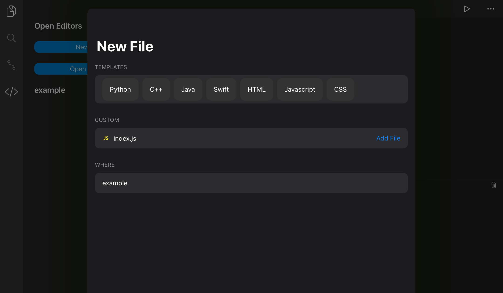
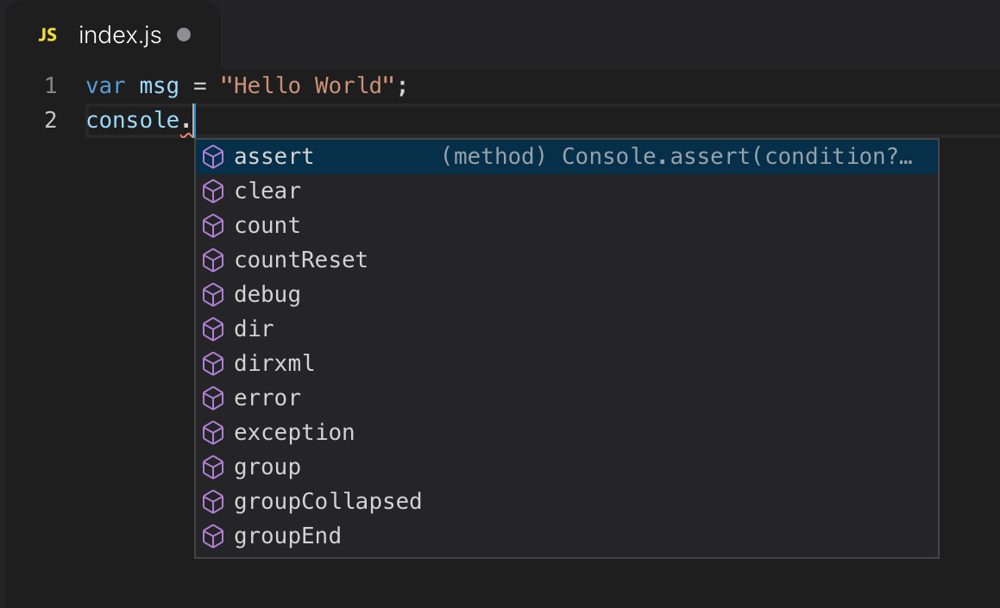
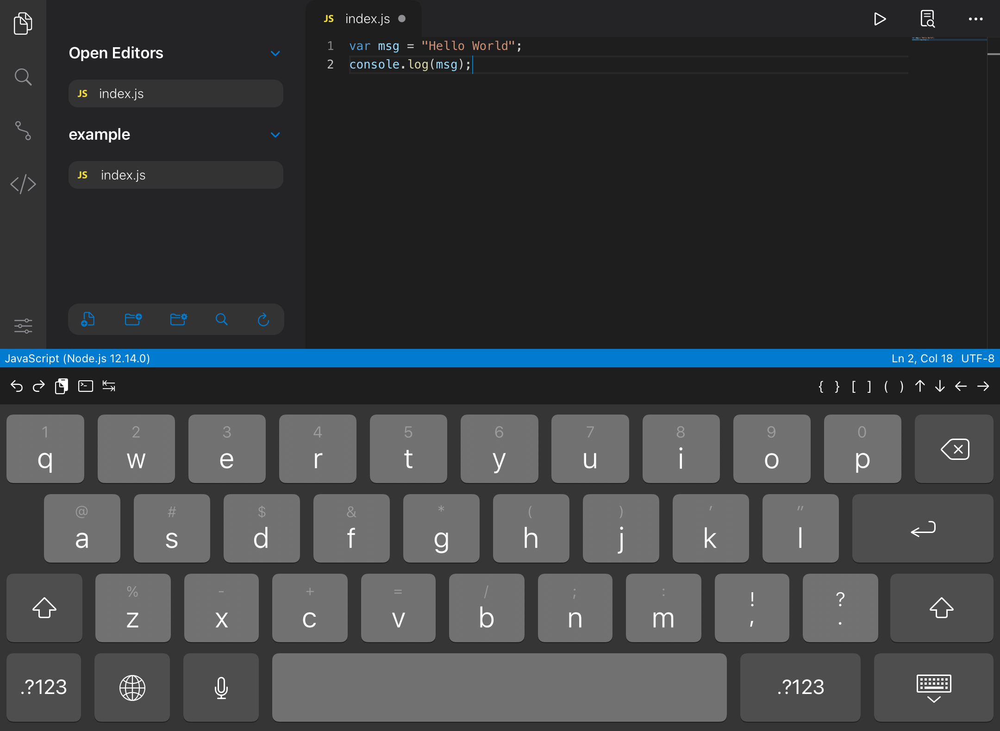
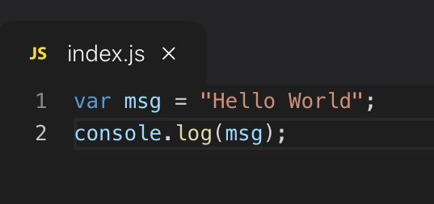
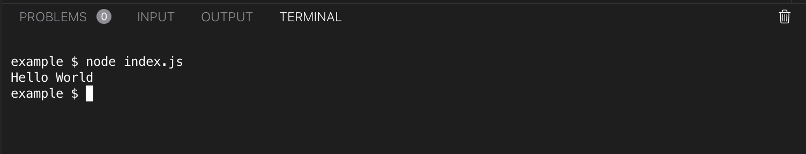
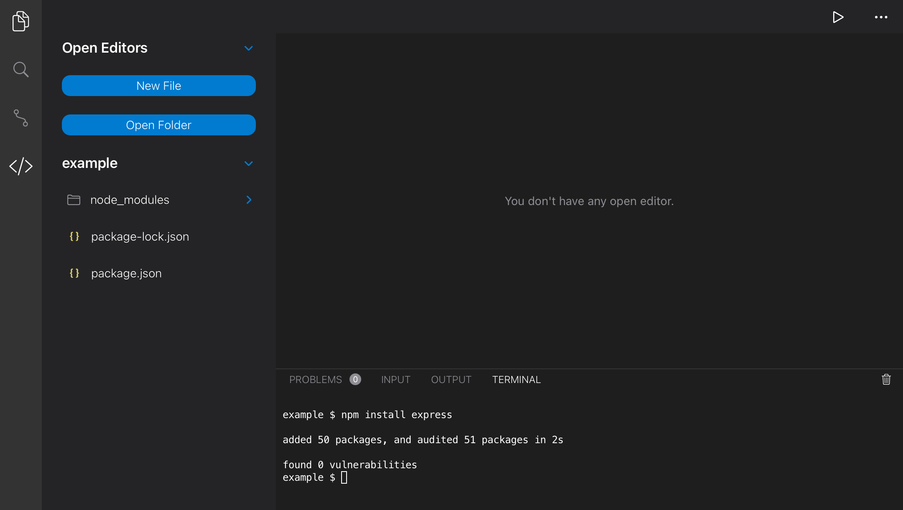
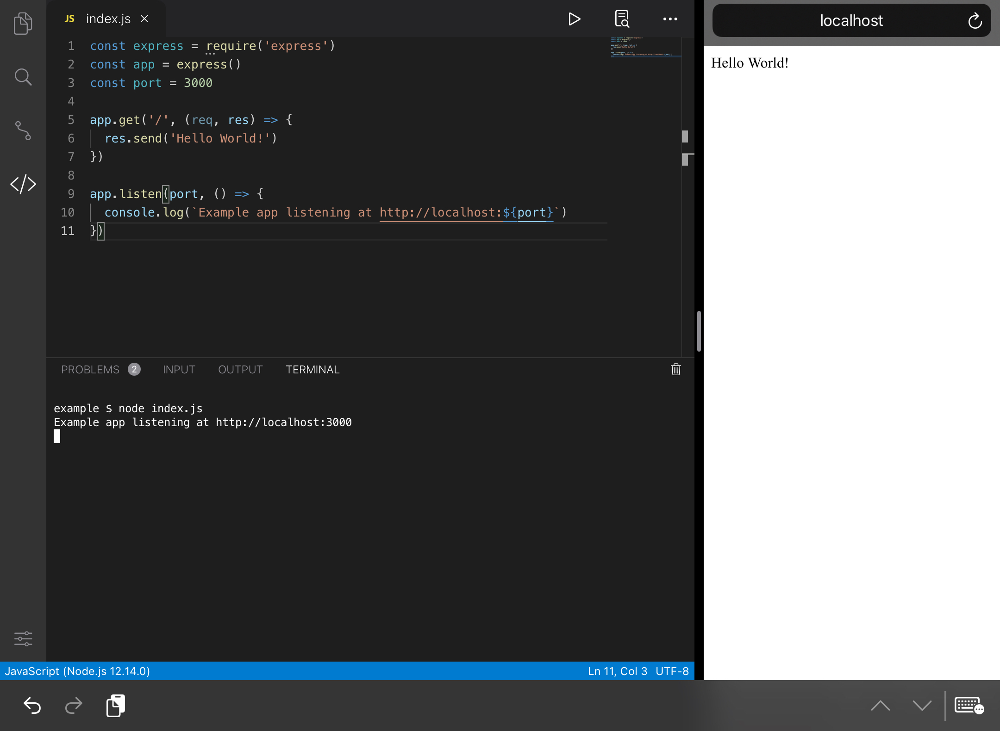

# Working with Node.js / npm in Code App

[Node.js](https://nodejs.org/) is a platform for building fast and scalable server applications using JavaScript. Node.js is the runtime and [npm](https://www.npmjs.com/) is the Package Manager for Node.js modules.

With release 1.2.0 (March 2021), Node.js runtime comes preinstalled in Code App with npm support.

## Running your first Node.js application

Let's start with creating a program that outputs a message to the console.

Create a file named `index.js`. You can either do it by the GUI or by a terminal command.
```
touch index.js
```



Create a string variable and output it to the console with the following code
```javascript
var msg = "Hello World";
console.log(msg);
```

Note that Code App will provide code suggestion (aka Intellisense) for Javascript based on your code's content.


Now, you can save the file by pressing `⌘S`. If you do not have a hardware keyboard, simply hide the keyboard by tapping the hide keyboard button at the bottom right corner.



Note that the circle icon became a cross icon. This indicates that the file is saved to the disk.



## Running index.js

There are two ways you can run a program in Code App - remotely or locally. For Javascript, both ways are supported. You can run Node.js from the built-in terminal.

Open the terminal panel by pressing `⌘J`, or the chevron (</>) icon on the sidebar and type `node index.js`. You should see the output of your script.



# Creating an Express application

[Express](https://expressjs.com/) is a popular web application framework for building web apps and APIs. You can install it with the package manager npm.

Install Express with the following command:
```
npm install express
```

You should be able to see 2 newly created files and a directory called `node_modules`. `node_modules` is where npm store your installed modules.



Create a new file called `index.js` and type the followings:
```javascript
const express = require('express')
const app = express()
const port = 3000

app.get('/', (req, res) => {
  res.send('Hello World!')
})

app.listen(port, () => {
  console.log(`Example app listening at http://localhost:${port}`)
})
```

Start the server by the follwing command:
```
node index.js
```

A express server instance is now running at `localhost:3000`. You can verify this by launching Safari side by side and navigate to the url.



To stop the server, you can press `control+c` on the terminal or press the stop button.

# Install Node.js modules globally

You can install extra terminal commands by installing Node.js modules globally. Examples include `typescript` and `prettier`.

To install a module globally, use the following command:
```
npm install {your_module_name} -g
```

You can now call the cli commands included in the package from anywhere. For example, `tsc` comes with `typescript` module. It transpiles TypeScript code into Javascript.