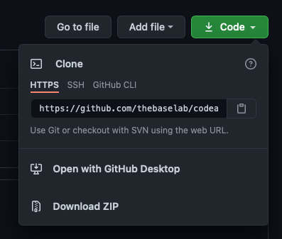
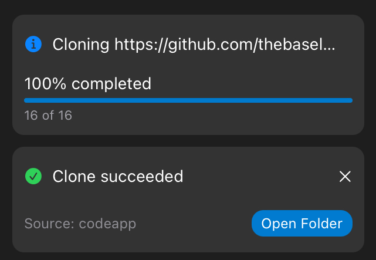

# Working with Version Control (Git) in Code App

Git is a very popular version control system. It is usually used for coordinating work among programmers collaboratively developing source code during software development.

Code App doesn't include the Git cli tool due to licensing issue. Instead, Git is integrated with the GUI of Code App. You can commit, push, pull, switch branches or compare the changes you have made in your source code.

## Cloning a repository

Let's start with cloning a repository from a Git remote. We'll be using a GitHub remote in this example. Copy the remote url to the clipboard. For example, `https://github.com/thebaselab/codeapp.git`.

Select source control on the sidebar and paste the https url to your remote to the `URL (HTTPS)` input field. Press return and the cloning should start. You can also search for a repository in GitHub in the `GitHub` field.

The repository is now cloned in your workspace folder. You can open the folder from the notification's button.

## Commit changes

Any changes made to your project will be detected by Git. Files showing in the `Changes` tab are in the working directory. From the source control tab, you can reverse the changes you have made, view the changes you have made or add it to the staging area.

Tap on the file name to view the changes you have made.

Tap on the add button and type your commit message.

Tap on the check icon or press `Command + Enter`. The changes is now committed.

## Pushing to a remote

To push changes to your remote, simply select the push option in the source control tab. 

Note that there are 2 numbers at the bottom left corner, the left one represents the number of commits you are behind the remote while the right one represents the number of commits you are ahead of the remote. 

You can only push to a remote when your repository is not behind the remote. To make your repository up to date, you'll need to fetch the changes from the remote.

## Fetching changes from a remote

Note that fetching and pulling are not the same. Git pulling is the process of fetching changes and merging, which not yet supported in Code App.

When you fetch changes from a remote, you'll notice there's no changes in your working directory. That's because you haven't checkout the changes from the repository.

## Switching and checkout branches

Select a branch or a tag by tapping the left bottom corner. If you have just fetched changes from a remote and is behind the remote repository, checkout to the remote whose name usually starts with `origin`.

